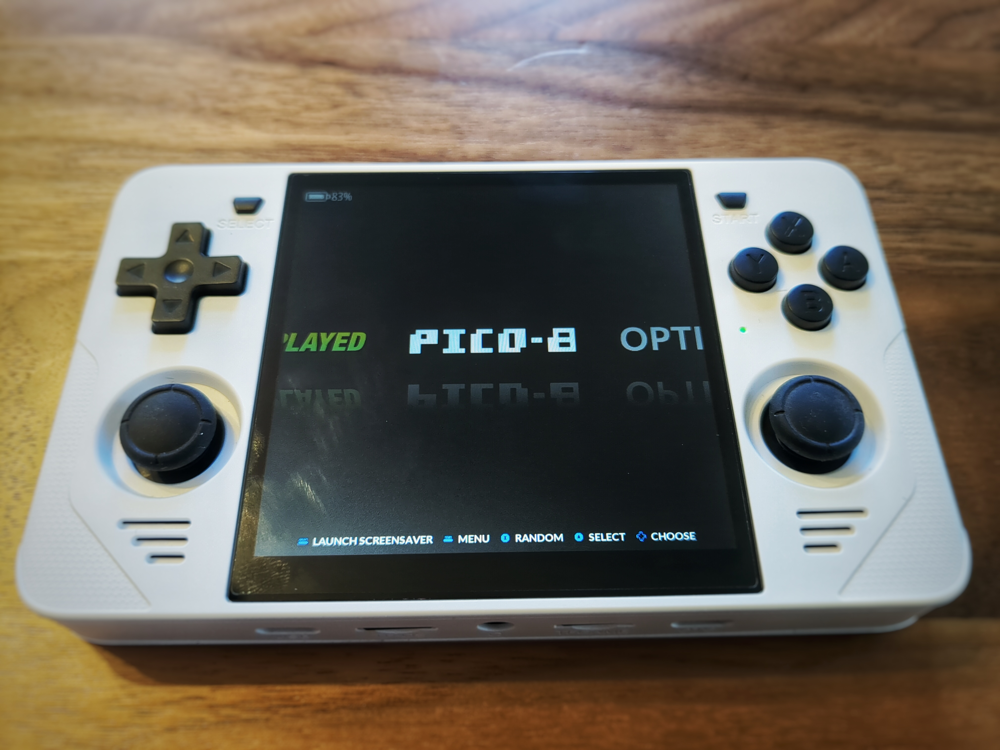
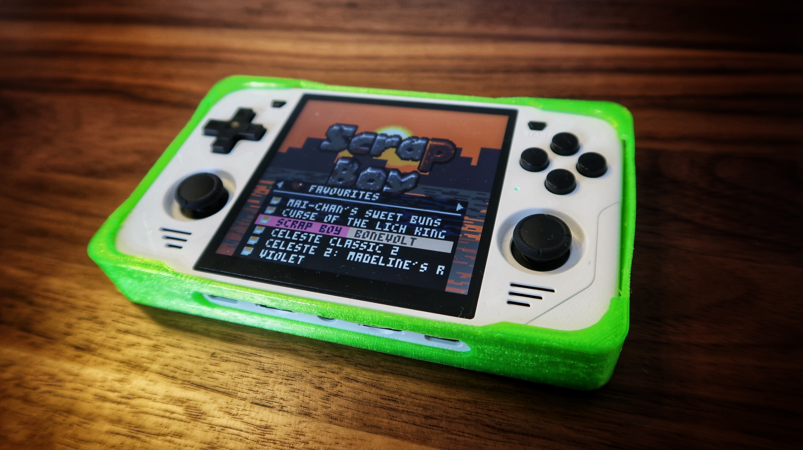
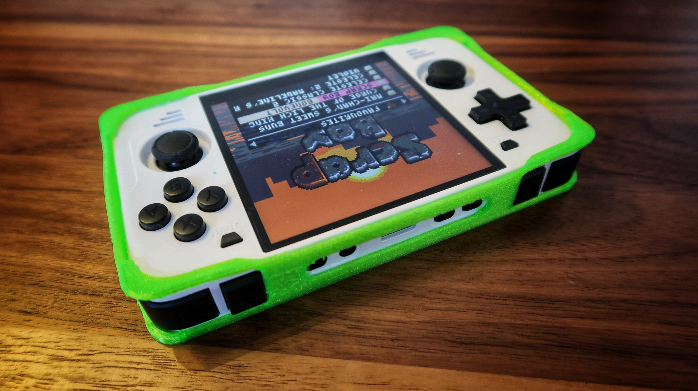
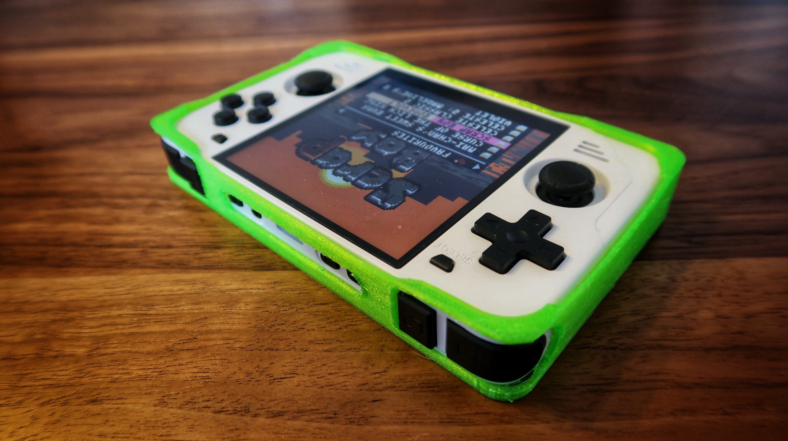
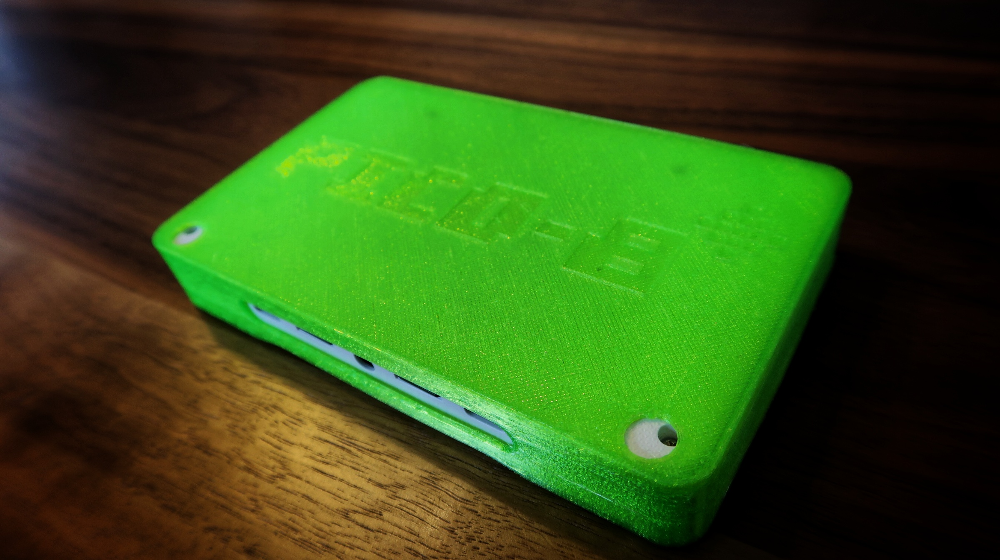

# Synopsis

I bought a Powkiddy RGB30 mainly for [pico-8](https://www.lexaloffle.com/pico-8.php) game development and as a dedicated pico-8 gaming device. The RGB30 doesn't come with a case, so I decided to model one. Before starting, a solid model is useful to work with - keeping the model in scope. I figured the community would find this model useful. This repository includes a reference model and a form fitting case. The reference model can be used for your own custom case mods, holders, wall mounts, etc. The form fitting case should be printed in TPU, with tree support structures.

I modeled this project using [Solvespace](https://solvespace.com/index.pl).

Thingiverse Pages 
* [Reference model](https://www.thingiverse.com/thing:6276014)
* [Protective Case](https://www.thingiverse.com/thing:6292727)

